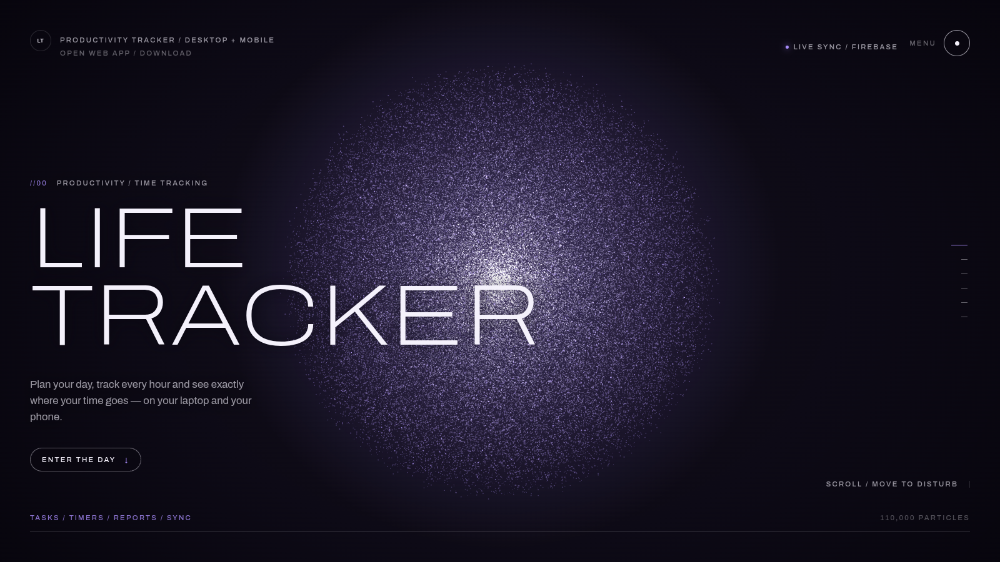
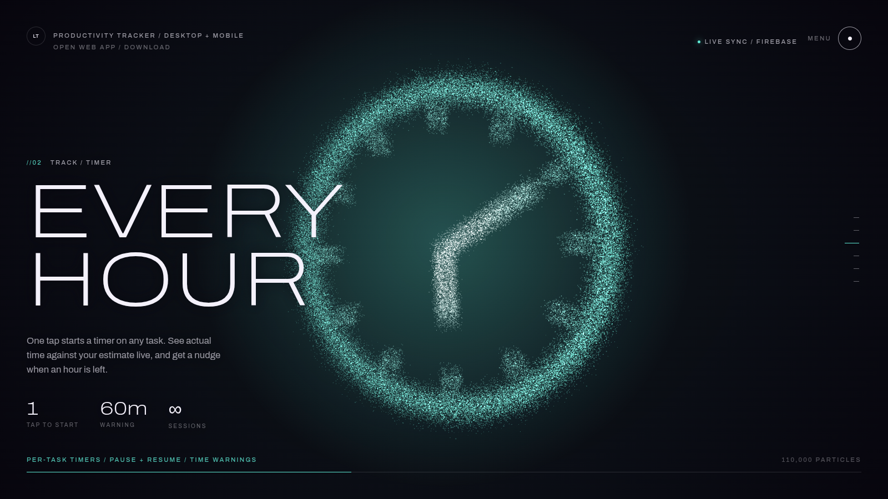
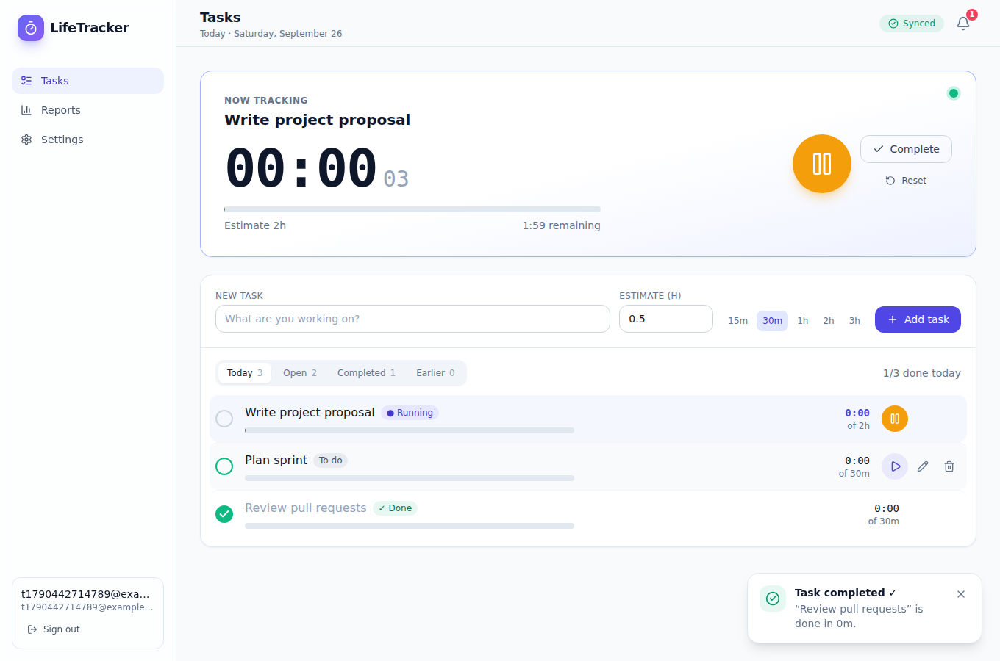
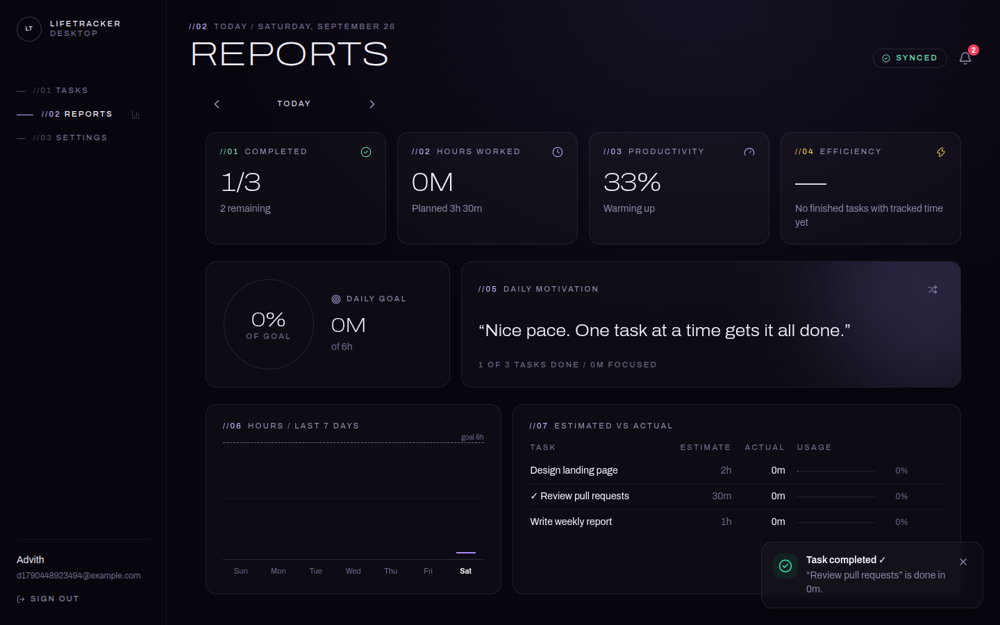
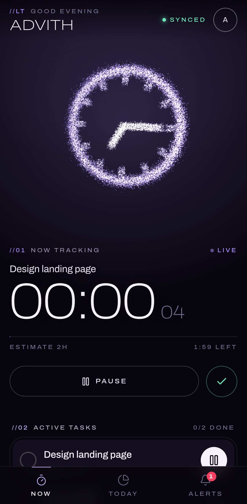
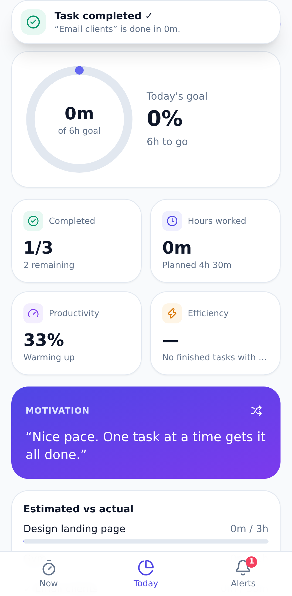

# LifeTracker

**A cross-platform productivity tracker.** Plan your day as tasks with time estimates, track the time you really spend on each one, and get daily reports on how the day went. The desktop app runs on Windows, macOS and Linux. A mobile companion (an installable PWA) keeps your phone in sync through Firebase, and both apps keep working offline.

**Live:** [lifetracker-90c0b.web.app](https://lifetracker-90c0b.web.app) (landing page) · [/app](https://lifetracker-90c0b.web.app/app/) (mobile web app) · [Downloads](https://github.com/amarnathgaddam75/Productivity_Tracker-/releases/latest)

| Landing — hero | Landing — timer section |
| --- | --- |
|  |  |

| Desktop — tasks & timer | Desktop — daily report | Mobile — now | Mobile — today |
| --- | --- | --- | --- |
|  |  |  |  |

## Design
Every surface shares one visual language: a near-black violet canvas, **Archivo** at weight 100 and 125% width for display type, tiny spaced-out `//NN` labels, pill buttons and hairline rules. At its centre is a **WebGL particle body** (`packages/shared/src/orb.js`, no dependencies). Tens of thousands of additive-blended points morph between a sphere, a cube, a clock face, a spiral and two linked orbs, drift with a gentle swirl and scatter from the cursor. When WebGL isn't available it falls back to a CSS glow, and it respects `prefers-reduced-motion`.
- **Landing page:** a scroll-driven story with one shape per section (plan, track, progress, sync, download). The download buttons link to the latest GitHub release assets.
- **Apps:** the whole app is one full-screen particle scene with the landing page's layout: brand top-left, sync, alerts and a menu button top-right, view ticks on the right edge, a full-screen menu, and a bottom rail showing today's stats that fills toward the daily goal. The orb follows what you are doing:
  - **Tasks:** a spinning particle clock while a timer runs (amber when about an hour is left, rose when over the estimate) and a silver cube when idle.
  - **Reports:** an amber galaxy.
  - **Settings and alerts:** two linked orbs.
  - Completing a task bursts it outward.

## Features

### Desktop app (Electron + React + Vite)
- **Accounts:** email/password sign-up, login and password reset with Firebase Auth. Each user's data is stored separately and only they can read it (enforced by Firestore rules).
- **Tasks:** add a task with a title and an estimate (with presets for 15m to 3h). You can edit inline (double-click), delete, and mark tasks complete or incomplete. Status chips show *To do / Running / Paused / Over / Done*, and filters show *Today / Open / Completed / Earlier*.
- **Timer:**
  - Each task has its own timer, and you start or pause it with one click. Only one timer runs at a time, so starting a new one pauses the current one.
  - The running task gets a large `HH:MM` display (seconds shown smaller), a bar for estimate vs actual, and the time remaining or over.
  - The timer state is saved (`runningSince` plus the recorded sessions). It keeps counting across restarts and between devices.
  - An optional **auto-start next task** setting starts the next task when you complete one.
- **Daily reports:**
  - Tasks completed today, hours worked, and a **productivity score** (completed / total).
  - **Efficiency %** (estimated / actual time for finished tasks).
  - A daily goal ring, a chart of the last 7 days, and a table of estimated vs actual time per task.
  - A **motivational message** picked from a curated list to match how your day is going (the shuffle button picks another).
- **Midnight reset:** time is recorded as sessions, so hours are counted on the right calendar day even when a timer runs past midnight. At midnight the day's summary is saved and unfinished tasks move to the new day (you can turn this off).
- **Notifications (in-app plus OS):**
  - Task completed ✓.
  - Time warning when **1 hour** is left on a task (for short tasks, 25% of the estimate).
  - Alert when a task goes over its estimate.
  - Daily goal reached 🎉 and all tasks done 🏆.
  - A daily summary at the hour you choose.
  - A notification centre with an unread badge (also shown on the dock or taskbar).
- **Sync:** live Firestore listeners, instant (optimistic) UI updates, last-write-wins conflict resolution, and a sync status indicator.

### The assistant (laptop + phone)
A Jarvis-style assistant (named Atlas; rename it in Settings) is the home screen of both apps.
- **Talk or type:** click the mic (or press **Ctrl+Shift+J** from anywhere) on the laptop, tap the mic on the phone, or type. It understands normal sentences and answers general questions.
- **It acts for you:** add, start, pause, finish, move and delete tasks. It can also set reminders ("remind me at 5 to call mom"), remember facts about you, change settings, give reports ("how was my week?") and the weather. On the laptop it can open websites and apps.
- **Brains** (Settings → Brain, chosen per laptop):
  | Brain | Cost | Notes |
  | --- | --- | --- |
  | Built-in | free, offline | Understands commands only |
  | Google Gemini | free API key ([aistudio.google.com/apikey](https://aistudio.google.com/apikey)) | Recommended; also enables laptop voice input |
  | Groq | free API key | Fast; also enables laptop voice input |
  | Ollama | free, runs on your laptop | Install from ollama.com, then run `ollama pull qwen3:8b` |
  | Claude, OpenAI, OpenRouter, custom OpenAI-compatible (LM Studio) | paid or your own server | |

  API keys are stored encrypted on the laptop (Electron `safeStorage`). They are only sent to the provider's own host.
- **One conversation everywhere:** the chat is synced. Questions asked on the phone are answered by your laptop's brain while the desktop app runs. Otherwise the phone answers with the built-in brain, or with its own key if you add one.
- **Learns your habits:** when you usually start, your best focus hours, how long tasks really take compared with your estimates, your streak, and the tasks you repeat. On an empty day it suggests those tasks, and it uses your habits when planning.
- **Proactive:** it gives a morning briefing, pauses the timer automatically when you're away, and nudges you when you're working untracked or on distractions. It also checks in, warns about pace, gives an end-of-day report and fires reminders. Everything is spoken aloud and pushed to the phone.

### Mobile companion (React PWA, create-react-app + Workbox)
- Log in with the same account.
- See the running task with a live timer, and pause or resume it with **one tap**.
- Today's task list with tap-to-start, tap-to-complete and quick add.
- Today's summary: goal ring, completed tasks, hours, score, efficiency and a motivational message.
- In-app toasts, an **Alerts** tab with a badge count, and an app-icon badge (`navigator.setAppBadge`) where the device supports it.
- Installable ("Add to Home Screen"). The app shell is precached, so it opens and works offline.
- Changes sync automatically with the desktop app in both directions.

### Offline support
Every change is applied to the UI right away and saved to `localStorage` in two places:
1. **A cache** of tasks, settings and notifications, so the app opens with your data even when offline.
2. **A sync queue** with one entry per document. Repeated edits to the same document merge into one entry, and the queue survives restarts.

When the device is back online (the `online` event, the app becoming visible, or a retry with backoff), the queue is sent to Firestore. Each write goes through a transaction that only replaces the server copy if the incoming `updatedAt` is newer (last-write-wins), and the Firestore rules enforce the same check on the server. Deletions are stored as "deleted" markers (tombstones), so they sync with the same rules.

## Project structure

```
productivity-tracker/
├── packages/
│   ├── desktop/          Electron + React (Vite, Tailwind)
│   │   ├── electron/     main process (app:// protocol, notifications, badge) + preload bridge
│   │   └── src/          renderer UI
│   ├── landing/          Landing page (Vite, vanilla JS) served at /
│   ├── mobile/           React PWA (create-react-app, Tailwind, Workbox) served at /app
│   └── shared/           Firebase setup, Zustand store, timer/report/sync logic, WebGL orb + unit tests
├── firebase/             Firestore security rules + indexes
├── .github/workflows/    CI, desktop installers (release), PWA deploy
├── firebase.json         Hosting (PWA) + emulator config
├── package.json          npm workspaces monorepo
├── SETUP.md              step-by-step setup, build & deploy guide
└── README.md
```

## Quick start

```bash
npm install
npm test                      # shared core unit tests

# Try everything locally without a Firebase project (needs Java 11+):
npm run emulators             # terminal 1 — Auth + Firestore emulators
echo "VITE_FIREBASE_EMULATOR_HOST=127.0.0.1" > packages/desktop/.env.local
echo "REACT_APP_FIREBASE_EMULATOR_HOST=127.0.0.1" > packages/mobile/.env.local
npm run dev:desktop           # terminal 2 — Electron app with hot reload
npm run dev:mobile            # terminal 3 — PWA at http://localhost:3000/app
npm run dev:landing           # (optional) landing page at http://localhost:5174
```

For a real Firebase project, building the installers and deploying the PWA, see **[SETUP.md](SETUP.md)**.

## Firestore data model

```
users/{uid}                         { email, displayName, createdAt }
users/{uid}/tasks/{taskId}          { id, title, estimatedHours, completed, completedAt,
                                      date: "YYYY-MM-DD", sessions: [{start, end}], baseMs,
                                      runningSince, createdAt, updatedAt, deleted, deviceId, carriedFrom? }
users/{uid}/summaries/{YYYY-MM-DD}  { totalTasks, completedTasks, hoursWorked, estimatedHours,
                                      productivityScore, efficiency, goalHours, goalReached, updatedAt }
users/{uid}/meta/settings           { displayName, dailyGoalHours, summaryHour, carryOver,
                                      autoStartNext, systemNotifications, assistant options, city, updatedAt }
users/{uid}/meta/presence           what the laptop is doing now + whether it answers the phone
users/{uid}/meta/push, devices/{id} Web Push keys and subscribed phones
users/{uid}/reminders/{id}          { text, at, done, firedAt?, deleted, createdAt, updatedAt }
users/{uid}/memories/{id}           { text, deleted, createdAt, updatedAt }
users/{uid}/chat/{id}               { role, text, from, status, replyTo?, actions?, deleted, createdAt, updatedAt }
```

Times are epoch milliseconds. The security rules are in [`firebase/firestore.rules`](firebase/firestore.rules). Users can read and write only their own documents, every field is validated, and an update is refused if it would replace a newer version with an older one.

## How the numbers are calculated

| Metric | Formula |
| --- | --- |
| Hours worked | Sum of all tracked session time that falls inside the day (a running timer counts up to now) |
| Productivity score | completed tasks ÷ tasks for the day × 100 |
| Efficiency | Σ estimate ÷ Σ actual time for finished tasks × 100 (100% = on estimate, >100% = faster) |
| Goal progress | hours worked ÷ daily goal (set in Settings, default 6h) |

"Tasks for the day" means tasks planned for that date, plus tasks completed or worked on that day.

## Tech stack
React 18 · Electron · Vite · create-react-app (PWA) · Workbox · Firebase Auth + Firestore · Zustand · Tailwind CSS · lucide icons · Vitest · electron-builder

## Known limitations
- Last-write-wins uses each device's clock. If a device's clock is badly wrong, its edits can win or lose unexpectedly.
- There is no server. Phone push, reminders and phone questions answered by the AI all need the desktop app running (it can run in the tray). Without it, the phone falls back to its built-in brain and fires reminders only while the phone app is open.
- The installers are unsigned unless you add code-signing certificates. Windows SmartScreen and macOS Gatekeeper will show a warning the first time the app is opened (see SETUP.md).
